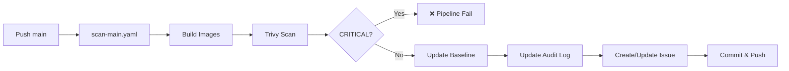
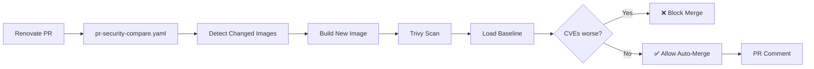
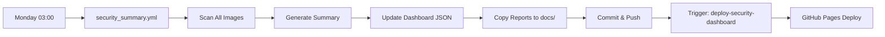

# Repository Documentation

Vollständige technische Dokumentation des DevSecOps Security Pipeline Projekts.

## Inhaltsverzeichnis

- [Repository-Struktur](#repository-struktur)
- [Workflows](#workflows)
- [Scripts](#scripts)
- [Outputs & Artifacts](#outputs--artifacts)
- [Datenfluss](#datenfluss)

---

## Repository-Struktur

```
sem5-pw-cis/
├── .github/
│   ├── workflows/          # GitHub Actions Workflows
│   └── renovate.json       # Renovate-Bot Konfiguration
├── audit-logs/             # Chronologische CVE-Scan-History pro Image
│   ├── php-mysql.md
│   ├── postgres-18.md
│   ├── python-3.14.md
│   ├── vote.md
│   ├── result.md
│   └── worker.md
├── cve-baseline/           # Aktuelle CVE-Baselines (JSON)
│   ├── php-mysql.json
│   ├── postgres-18.json
│   ├── python-3.14.json
│   ├── vote.json
│   ├── result.json
│   └── worker.json
├── docs/                   # Security Dashboard (GitHub Pages)
│   ├── index.html          # Dashboard-Hauptseite
│   ├── dashboard.js        # Chart.js Visualisierung
│   ├── cve-details.html    # Detailansicht CVEs
│   ├── cve-details.js
│   ├── style.css
│   └── data/
│       ├── security-summary.json   # Aggregierte Security-Daten
       └── trivy-reports/          # Trivy JSON Reports für Dashboard
           ├── php-mysql.json
           ├── postgres-18.json
           ├── python-3.14.json
           ├── vote.json
           ├── result.json
           └── worker.json
├── images/                 # Gehärtete Container-Images
│   ├── php-mysql/
│   │   ├── Dockerfile
│   │   ├── composer.json
│   │   └── src/
│   ├── postgres/
│   │   └── Dockerfile
│   └── python/
│       └── Dockerfile
├── scripts/
│   └── generate_security_summary.py  # Security-Summary-Generator
├── sbom/                   # SBOM Output-Verzeichnis (nicht committed)
├── README.md               # Projekt-Übersicht
├── SECURITY.md             # Security & SBOM Dokumentation
└── SECURITY_PIPELINE.md    # Pipeline-Architektur
```

---

## Workflows

### 1. `scan-main.yaml` - Container Security Scan

**Trigger:**

- Push auf `main` Branch
- Wöchentlich: Sonntag 00:00 UTC (`cron: "0 0 * * 0"`)
- Manuell (`workflow_dispatch`)

**Funktion:**
Scannt alle Container-Images auf Schwachstellen (MEDIUM, HIGH, CRITICAL).

**Matrix:**

- `postgres-18` (images/postgres)
- `8.1-apache-mysql` (images/php-mysql)
- `python-3.14` (images/python)
- `vote`, `result`, `worker` ([example-voting-app](https://github.com/dockersamples/example-voting-app))

**Ablauf:**

1. Checkout Repository
2. Docker Buildx Setup
3. Trivy DB Cache
4. Image Build (lokal)
5. Trivy Scan → JSON Output
6. **CVE Gate**: Blockiert bei CRITICAL > 0
   - **Exception**: Test-Images (`vote`, `result`, `worker`) werden übersprungen
   - Grund: Demonstration der Pipeline-Funktionalität mit realistischen Schwachstellen
   - Diese Images stammen von ([example-voting-app](https://github.com/dockersamples/example-voting-app)) Empfehlung von Prof. Nestlers für Test-Zwecke
   - Vulnerabilities werden trotzdem vollständig getrackt und dokumentiert
7. Extrahiert MEDIUM+ Vulnerabilities → Tabelle
8. **Update CVE Baseline**:
   - Speichert in `cve-baseline/<image>.json`
   - Zählt CRITICAL/HIGH/MEDIUM
   - Berechnet Risk-Index: `CRIT*5 + HIGH*3 + MED`
   - Erkennt neue/behobene CVEs (Lifecycle)
9. **Update Audit Log**:
   - Speichert in `audit-logs/<image>.md`
   - Top 5 CRITICAL/HIGH CVEs mit CVSS-Score
   - Lifecycle Changes (neu/behoben)
10. **Issue Management**:
    - Erstellt Issue mit Label `image:<name>`
    - Oder aktualisiert bestehendes Issue (append)
    - Tabelle mit MEDIUM+ Vulnerabilities
11. Commit & Push (Baselines + Audit Logs)

**Outputs:**

- `cve-baseline/<image>.json`
- `audit-logs/<image>.md`
- GitHub Issues mit Label `security`, `trivy`, `image:<name>`

---

### 2. `pr-security-compare.yaml` - PR Security Comparison

**Trigger:**

- Pull Request (opened, synchronize, reopened)

**Funktion:**
Vergleicht CVE-Anzahl vor/nach Dependency-Update. Verhindert Security-Regression.

**Ablauf:**

1. **Detect Changes**: `dorny/paths-filter` prüft geänderte Image-Pfade
2. **Dynamic Matrix**: Nur geänderte Images werden gescannt
3. **Build & Scan**: Neues Image (PR-Branch)
4. **Baseline Load**: Lädt `cve-baseline/<image>.json` vom `main` Branch
5. **Comparison**:
   ```
   NEW_CRIT vs BASELINE_CRIT
   NEW_HIGH vs BASELINE_HIGH
   NEW_MED  vs BASELINE_MED
   ```
6. **Auto-Merge Entscheidung**:
   - ✅ Erlaubt: Wenn CVE-Anzahl sinkt oder gleich bleibt
   - ❌ Blockiert: Bei neuen CRITICAL oder steigenden Zahlen
7. **PR Comment**: Zeigt Vergleichstabelle

**Outputs:**

- PR Comment mit Security-Vergleich
- Status Check: `compare` (required für Auto-Merge)

---

### 3. `security_summary.yml` - Weekly Security Summary & Dashboard

**Trigger:**

- Wöchentlich: Montag 03:00 UTC (`cron: "0 3 * * 1"`)
- Manuell (`workflow_dispatch`)

**Funktion:**
Generiert wöchentlichen Security-Report und aktualisiert Dashboard.

**Jobs:**

#### Job 1: `scan-images` (Matrix)

Scannt alle Images parallel:

**Matrix:**

- php-mysql, postgres, python, vote, result, worker

**Steps:**

1. Build Image
2. Trivy JSON Scan → `reports/trivy/<image>.json`
3. Trivy SARIF Scan → `reports/trivy/<image>.sarif` (MEDIUM+)
4. Upload Artifacts (7 Tage Retention)

#### Job 2: `generate-summary`

Aggregiert alle Scans:

**Steps:**

1. Download alle Trivy-Artifacts
2. **Upload SARIF** → GitHub Security Tab (Code Scanning)
   - Kategorien: `container-security-<image>`
3. **Generate Security Summary**:
   ```bash
   python scripts/generate_security_summary.py \
     --trivy reports/trivy/*.json \
     --previous docs/data/security-summary.json \
     --output docs/data/security-summary.json
   ```
4. **Copy Reports** → `docs/data/trivy-reports/`
5. **Update CVE Baselines**:
   - Loop über alle Images
   - Speichert `cve-baseline/<image>.json`
   - Inkl. CVE-Liste für Lifecycle-Tracking
6. Commit & Push (auto-commit bot)

**Outputs:**

- `docs/data/security-summary.json` (für Dashboard)
- `docs/data/trivy-reports/*.json` (für CVE-Details)
- `cve-baseline/*.json` (aktualisiert)
- GitHub Security Tab (SARIF Uploads)

**Security Summary JSON-Struktur:**

```json
{
  "generatedAt": "2025-12-11T03:00:00Z",
  "period": {"start": "2025-12-04", "end": "2025-12-11"},
  "images": [
    {"name": "postgres-18", "critical": 0, "high": 2, "medium": 5, "low": 12, "unknown": 0},
    {"name": "php-mysql", "critical": 1, "high": 3, "medium": 8, "low": 20, "unknown": 0}
  ],
  "totals": {"critical": 1, "high": 5, "medium": 13, "low": 32, "unknown": 0},
  "delta": {"critical": 0, "high": -2, "medium": 1, "low": 3, "unknown": 0},
  "direction": "better",
  "trend": [
    {"date": "2025-11-27", "critical": 1, "high": 7, "medium": 12},
    {"date": "2025-12-04", "critical": 1, "high": 5, "medium": 13}
  ],
  "riskIndex": 45,
  "riskIndexMethod": "(critical*10 + high*5 + medium*2) / 300 * 100",
  "version": 3,
  "sources": ["reports/trivy/php-mysql.json", ...]
}
```

---

### 4. `sbom.yml` - SBOM Generation

**Trigger:**

- Monatlich: 1. Tag 02:00 UTC (`cron: "0 2 1 * *"`)
- Manuell (`workflow_dispatch`)

**Funktion:**
Erstellt Software Bill of Materials (CycloneDX JSON Format).

**Steps:**

1. **Repository SBOM**:
   - Tool: Anchore SBOM Action (Syft)
   - Output: `sbom/sbom-cyclonedx.json`
   - Dependency-Snapshot → GitHub Dependency Graph
2. **Image SBOMs**:
   - Baut alle 6 Images (php-mysql, postgres, python, vote, result, worker)
   - Syft-Scan pro Image:
     ```bash
     syft docker:<image>:latest -o cyclonedx-json > sbom/<image>.cyclonedx.json
     ```
3. Upload Artifacts (30 Tage Retention)

**Outputs:**

- Artifact: `sbom-cyclonedx` (Repo-SBOM)
- Artifact: `sbom-images-cyclonedx` (Image-SBOMs)
- GitHub Dependency Graph aktualisiert

**Wichtig:** SBOMs werden **nicht** committed, nur als Artifacts gespeichert.

---

### 5. `deploy-gated-by-cves.yml` - CVE-Gated Deployment

**Trigger:**

- Push auf `main`
- Manuell (`workflow_dispatch`)

**Funktion:**
Verhindert Deployment, wenn CRITICAL CVEs vorhanden sind.

**Ablauf:**

1. Lädt alle `cve-baseline/*.json`
2. Prüft jedes Image auf `"critical" > 0`
3. **Blockiert** (exit 1) wenn CRITICAL gefunden
4. **Erlaubt** Deployment wenn keine CRITICAL

**Outputs:**

- Status Check für Deployment-Gate
- Log-Meldungen (✅ erlaubt / ❌ blockiert)

---

### 6. `archive-old-scans.yaml` - Archive Old CVE Scans

**Trigger:**

- Täglich: 03:00 UTC (`cron: "0 3 * * *"`)
- Manuell (`workflow_dispatch`)

**Funktion:**
Klappt alte Scan-Blöcke in GitHub Issues ein (Collapsible Details).

**Ablauf:**

1. Lädt alle offenen Issues mit Label `security`
2. Sucht Scan-Header: `## 2025-XX-XX` oder `## Scan 2025-XX-XX`
3. Behält **neuesten** Scan sichtbar
4. Wrapped **ältere** Scans in `<details>`:
   ```html
   <details>
     <summary>2025-11-27</summary>
     [Scan-Inhalt]
   </details>
   ```
5. Aktualisiert Issue-Body

**Outputs:**

- Aktualisierte GitHub Issues (bessere Lesbarkeit)

---

### 7. `auto-close-renovate-issues.yaml` - Auto-Close Renovate Issues

**Trigger:**

- Pull Request geschlossen (`types: [closed]`)

**Funktion:**
Schließt zugehörige Renovate-Issues automatisch nach PR-Merge.

**Ablauf:**

1. Prüft: PR merged + Label `renovate`
2. Sucht offene Issues mit Label `renovate`
3. Schließt Issues, die PR-URL im Body enthalten

**Outputs:**

- Geschlossene Renovate-Issues

---

### 8. `cleanup-old-runs.yml` - Cleanup Old Workflow Runs

**Trigger:**

- Wöchentlich: Sonntag 02:00 UTC (`cron: '0 2 * * 0'`)
- Manuell (`workflow_dispatch`)

**Funktion:**
Löscht alte Workflow-Runs (spart Speicherplatz).

**Konfiguration:**

- `retain_days: 30` (behält letzte 30 Tage)
- `keep_minimum_runs: 5` (mindestens 5 Runs behalten)

**Outputs:**

- Reduzierter Actions-Speicher

---

### 9. `deploy-security-dashboard.yaml` - Deploy Security Dashboard

**Trigger:**

- Workflow Run completed: `weekly-security-summary`

**Funktion:**
Deployt Security Dashboard auf GitHub Pages.

**Ablauf:**

1. Checkout Repository
2. Build Dashboard:
   - Kopiert `audit-logs/`, `cve-baseline/`, `security-summary/` → `public/`
   - Generiert `index.html` mit Chart.js
3. Parse Audit Logs → Extrahiert Risk-Index pro Datum
4. Rendert Trend-Chart (Canvas)
5. Deploy → GitHub Pages

**Outputs:**

- Live Dashboard: https://konrading.github.io/sem5-pw-cis/

---

### 10. `manage-issues.yml` - Manual Issue Management

**Trigger:**

- Nur manuell (`workflow_dispatch`)

**Funktion:**
Hilfswerkzeug für manuelle Issue-Operationen (z.B. Labels hinzufügen, schließen).

**Aktuell:**

- Schließt Issue #39 (Workflow-Test)
- Labelt Issues #31, #30 (security, trivy, image-labels)

**Verwendung:**
Template für zukünftige manuelle Issue-Operationen.

---

## Scripts

### `generate_security_summary.py`

**Zweck:** Aggregiert Trivy JSON-Reports zu einem Dashboard-freundlichen Summary.

**Parameter:**

```bash
--trivy <file1.json> <file2.json>  # Trivy-Reports (oder --trivy-dir)
--previous <summary.json>          # Vorherige Summary (für Trend)
--output <summary.json>            # Output-Pfad
--history-limit <int>              # Max Trend-Einträge (default: 26)
--min-history <int>                # Min Trend-Einträge (default: 4)
--backfill-mode <mode>             # repeat|zeros (default: repeat)
```

**Funktionen:**

1. **Parse Trivy Reports**:

   - Liest JSON-Dateien
   - Zählt Vulnerabilities pro Severity
   - Gruppiert nach Image-Name

2. **Compute Metrics**:

   - **Totals**: Summe aller Severities
   - **Risk Index**: `(CRIT*10 + HIGH*5 + MED*2) / 300 * 100` (gecappt bei 100)
   - **Delta**: Differenz zu vorheriger Woche
   - **Direction**: `better` / `worse` / `stable`

3. **Trend Tracking**:

   - Behält letzte 26 Wochen (default)
   - Dedupliziert nach Datum
   - Synthetisches Backfill wenn < min_history

4. **Output**: JSON (Version 3 Schema)

**Beispiel:**

```bash
python scripts/generate_security_summary.py \
  --trivy reports/trivy/postgres.json reports/trivy/php-mysql.json \
  --previous docs/data/security-summary.json \
  --output docs/data/security-summary.json
```

---

## Outputs & Artifacts

### GitHub Actions Artifacts

| Workflow               | Artifact Name           | Inhalt             | Retention |
| ---------------------- | ----------------------- | ------------------ | --------- |
| `security_summary.yml` | `trivy-<image>`         | JSON + SARIF Scans | 7 Tage    |
| `sbom.yml`             | `sbom-cyclonedx`        | Repository SBOM    | 30 Tage   |
| `sbom.yml`             | `sbom-images-cyclonedx` | Image SBOMs        | 30 Tage   |

### Repository Files (committed)

| Pfad                              | Beschreibung                      | Update-Frequenz |
| --------------------------------- | --------------------------------- | --------------- |
| `cve-baseline/<image>.json`       | CVE Baseline für Auto-Merge       | Bei jedem Scan  |
| `audit-logs/<image>.md`           | Chronologische Scan-History       | Bei jedem Scan  |
| `docs/data/security-summary.json` | Aggregierter Security-Report      | Wöchentlich     |
| `docs/data/trivy-reports/*.json`  | Trivy-Reports (Dashboard-Zugriff) | Wöchentlich     |

### GitHub Issues

**Format:**

- Titel: `Security alerts: <image-name>`
- Labels: `security`, `trivy`, `image:<name>`
- Body: Tabelle mit MEDIUM+ CVEs (append-only, neueste zuerst)

**Lifecycle:**

- Erstellt: Bei erstem Fund von MEDIUM+ CVEs
- Aktualisiert: Bei jedem Scan (neuer Block)
- Archiviert: Alte Scans → `<details>` (täglich via `archive-old-scans.yaml`)

### GitHub Security Tab

**SARIF Uploads:**

- Kategorien: `container-security-<image>`
- Quelle: `security_summary.yml`
- Inhalte: MEDIUM+ Vulnerabilities aus Trivy

---

## Datenfluss

### 1. Push auf `main` → Scan



### 2. Renovate PR → Security Compare



### 3. Wöchentlicher Zyklus → Dashboard



---

## Renovate-Bot Konfiguration

**Datei:** `.github/renovate.json`

**Einstellungen:**

- `enabledManagers: ["dockerfile"]` - Nur Dockerfiles
- `disableMajorUpdates` - Keine Major-Versions-Updates
- `pinDigests: true` - Digest-Pinning für Reproduzierbarkeit
- `automerge: true` - Auto-Merge wenn Status Checks ✅
- `requiredStatusChecks: ["scan-main"]` - Gate: Scan muss erfolgreich sein

**Package Rules:**

1. **Digest/Patch/Minor**: Auto-Merge aktiviert
2. **Security Updates**: Höchste Priorität (`prPriority: 100`)
3. **Major Updates**: Deaktiviert

---

## Dashboard-Struktur

### `docs/index.html`

- Hauptseite mit Security-Übersicht
- Chart.js Trend-Visualisierung
- Lädt `data/security-summary.json`

### `docs/dashboard.js`

- Risk-Index Trend-Chart
- Severity-Verteilung (Donut-Chart)
- Delta-Anzeige (Woche-zu-Woche)

### `docs/cve-details.html`

- Detailansicht pro Image
- Lädt Trivy-Reports aus `data/trivy-reports/`
- Tabelle mit allen CVEs (filterbar, sortierbar)

### `docs/cve-details.js`

- JavaScript für CVE-Detail-Tabelle
- CVSS-Score Farbcodierung
- Link zu NVD/Primary URL

---

## Wichtige Konzepte

### CVE Baseline

**Zweck:** Referenzpunkt für Security-Vergleiche

**Inhalt:**

```json
{
  "date": "2025-12-11",
  "critical": 0,
  "high": 3,
  "medium": 7,
  "risk_index": 29,
  "cves": ["CVE-2024-1234", "CVE-2024-5678", ...]
}
```

**Verwendung:**

- PR-Security-Compare: Vergleich alt vs. neu
- Lifecycle-Tracking: Neue/behobene CVEs erkennen

### Risk Index

**Formel:** `(CRITICAL*10 + HIGH*5 + MEDIUM*2) / 300 * 100`

**Interpretation:**

- 0-20: Niedriges Risiko (grün)
- 21-50: Mittleres Risiko (gelb)
- 51-80: Hohes Risiko (orange)
- 81-100: Kritisches Risiko (rot)

**Normalisierung:** Maximal 100 (basiert auf 300 Punkten = Worst Case)

### Auto-Merge Logik

**Bedingungen (alle müssen erfüllt sein):**

1. ✅ `scan-main` Status Check erfolgreich
2. ✅ Keine neuen CRITICAL CVEs
3. ✅ CVE-Anzahl sinkt oder bleibt gleich
4. ✅ PR hat Label `renovate`

**Blockierung erfolgt bei:**

- ❌ Neue CRITICAL CVEs
- ❌ Steigende MEDIUM/HIGH Zahlen
- ❌ `scan-main` schlägt fehl

---

## Troubleshooting

### Issue wird nicht erstellt

- Prüfen: Sind MEDIUM+ CVEs vorhanden?
- Prüfen: `issues: write` Permission gesetzt?
- Label `image:<name>` bereits vorhanden?

### Auto-Merge funktioniert nicht

- Prüfen: `requiredStatusChecks` in `renovate.json`
- Prüfen: Branch-Protection-Rules
- Prüfen: PR-Security-Compare Status

### Dashboard zeigt alte Daten

- Manuell Workflow ausführen: `security_summary.yml`
- Prüfen: GitHub Pages Deployment Status
- Cache leeren: Ctrl+Shift+R

### Trivy DB-Cache Fehler

- Workflow neu starten (Cache wird neu aufgebaut)
- Prüfen: `~/.cache/trivy` in Actions Cache

---

**Letzte Aktualisierung:** 2025-12-11
