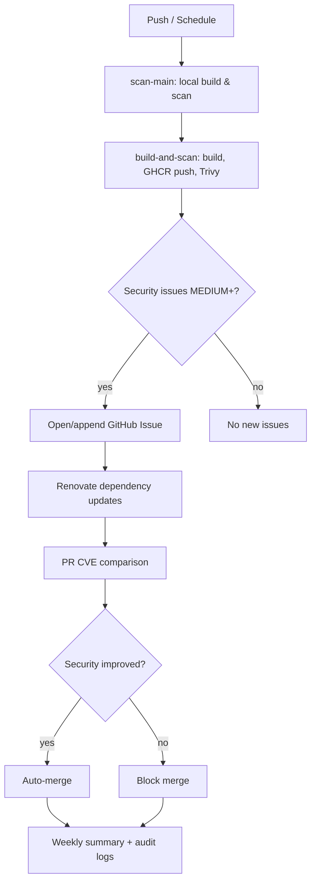

# Secure Container Images – DevSecOps Pipeline

A fully automated DevSecOps pipeline for hardened container images with a strong focus on vulnerability management, automated dependency updates, and transparent security reporting. The goal is a reproducible, auditable, and customer‑ready example of modern container security practices.

## Table of Contents

- [Overview](#overview)
- [Included Images](#included-images)
- [Pipeline](#pipeline)
- [Implemented Controls](#implemented-controls)
- [Security Reporting](#security-reporting)
- [Repository Structure](#repository-structure)
- [Planned Enhancements](#planned-enhancements)
- [Target Audience](#target-audience)

## Overview

All images are built, scanned, and monitored automatically for known vulnerabilities. Dependency updates are proposed via Renovate, compared against the current CVE baseline, and merged only when security improves.

## Included Images

| Image               | Description                                           |
| ------------------- | ----------------------------------------------------- |
| `postgres-secured`  | Hardened PostgreSQL container image                   |
| `php-mysql-secured` | PHP and MySQL container image with security hardening |

## Pipeline

The security pipeline runs on push and on schedule. It scans locally, builds and scans images, opens/updates security issues, and auto‑merges safe dependency updates.



## Implemented Controls

### Container Vulnerability Scanning

- Scanner: Trivy
- Triggers: on every push to `main` and on scheduled runs
- Severities evaluated: MEDIUM, HIGH, CRITICAL

### Automated Security Issues

- Creates/updates a GitHub Issue automatically when MEDIUM+ vulnerabilities are detected
- Appends dated scan blocks to the existing issue
- Auto‑closes the issue when no MEDIUM+ vulnerabilities remain

### Automated Dependency Updates (Renovate)

- Manages Docker base images, digests, and patch versions
- Major version updates disabled; security‑relevant updates prioritized
- Auto‑merge only when all security checks pass

### Hard Blocking Rules

| Condition                      | Behaviour             |
| ------------------------------ | --------------------- |
| CRITICAL vulnerability present | Auto‑merge is blocked |
| Vulnerability count increases  | Auto‑merge is blocked |
| Vulnerability count decreases  | Auto‑merge is allowed |

## Security Reporting

### Weekly Security Summary & Dashboard

The file `docs/data/security-summary.json` is generated weekly (and can be run on-demand) and powers the web dashboard in `docs/`.

Current JSON structure (version 3):

```
{
	"generatedAt": "UTC timestamp",
	"period": {"start": "YYYY-MM-DD", "end": "YYYY-MM-DD"},
	"images": [
		{"name": "image-name", "critical": 0, "high": 1, "medium": 2, "low": 5, "unknown": 0}
	],
	"totals": {"critical": 0, "high": 1, "medium": 2, "low": 5, "unknown": 0},
	"delta": {"critical": 0, "high": -1, "medium": 0, "low": 2, "unknown": 0},
	"direction": "better|worse|stable",
	"trend": [
		{"date": "2025-11-20", "critical": 0, "high": 1, "medium": 2},
		{"date": "2025-11-27", "critical": 0, "high": 0, "medium": 2}
	],
	"riskIndex": 7,
	"riskIndexMethod": "(critical*10 + high*5 + medium*2) / 300 * 100; capped at 100",
	"version": 3,
	"sources": ["reports/trivy/php-mysql.json", "reports/trivy/postgres.json"]
}
```

The dashboard expects flattened image severity fields and a `trend` array for Chart.js.

### Generation Script

`scripts/generate_security_summary.py` can be invoked manually:

```bash
python scripts/generate_security_summary.py \
	--trivy reports/trivy/php-mysql.json reports/trivy/postgres.json \
	--previous docs/data/security-summary.json \
	--output docs/data/security-summary.json
```

If `--trivy` paths are omitted it auto-discovers JSON reports in `--trivy-dir` (default `reports/trivy`). Missing or invalid reports produce a placeholder entry.

### Automated Workflow

The GitHub Actions workflow `.github/workflows/security_summary.yml` runs weekly (Monday 03:00 UTC) and on manual dispatch:

1. Builds the container images.
2. Scans them with Trivy (JSON output stored under `reports/trivy/`).
3. Generates/updates `security-summary.json` with historical trend retention (last 26 entries by default).
4. Commits and pushes changes if there are modifications.

Adjust the cron schedule or history retention via workflow or script parameters as needed.

### Audit Logs

- Individual, chronological logs per container image
- Suitable for audits, reviews, and customer reporting
- Directory: `audit-logs/`

## DevSecOps Principles

- Shift‑left security: detect vulnerabilities early in the pipeline
- Full automation: minimal manual intervention
- Transparency: all security decisions visible in‑repo
- Reproducibility: every scan and decision is traceable

## Repository Structure

| Path                  | Purpose                           |
| --------------------- | --------------------------------- |
| `.github/workflows/`  | CI/CD and security pipelines      |
| `images/`             | Dockerfiles for container images  |
| `audit-logs/`         | Long‑term security logs           |
| `cve-baseline/`       | Reference vulnerability baselines |
| `SECURITY_SUMMARY.md` | Security documentation            |

## Planned Enhancements

- Web‑based security dashboard (GitHub Pages)
- Graphical vulnerability trend visualization
- Static Application Security Testing (SAST)
- Config and infrastructure misconfiguration scanning
- Exportable customer‑ready security reports

## Target Audience

- Software developers
- DevSecOps and security engineers
- Auditors and customers
- Education and demonstrations

---

This repository demonstrates how to implement container security in a fully automated, auditable, and customer‑friendly way using modern DevSecOps practices. It serves as both a reference implementation and an educational example for secure container pipelines.
