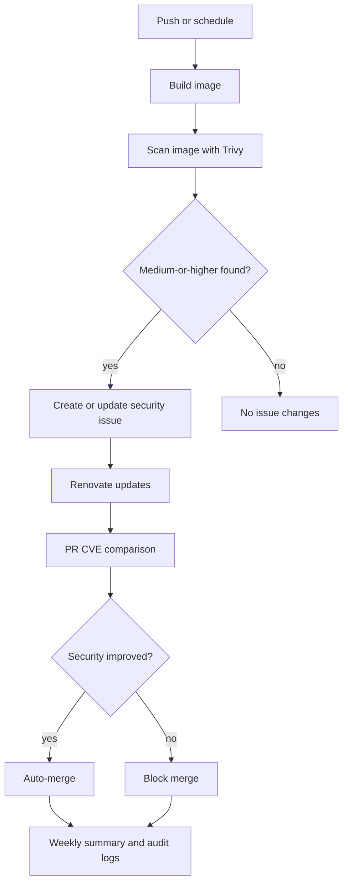

# Security Pipeline Overview

This document describes how security is implemented, enforced, and maintained within this repository. It serves as the authoritative explanation of the security pipeline for customers, auditors, and internal stakeholders. The focus lies on container security, vulnerability management, automated remediation, and full traceability.

## Table of Contents

- [Security Objectives](#security-objectives)
- [Pipeline Architecture](#pipeline-architecture)
- [Container Vulnerability Scanning](#container-vulnerability-scanning)
- [Automated Security Issues](#automated-security-issues)
- [Dependency Updates and Patch Management](#dependency-updates-and-patch-management)
- [Security Comparison Before Merge](#security-comparison-before-merge)
- [Weekly Security Summary](#weekly-security-summary)
- [Audit Logs](#audit-logs)
- [Transparency and Traceability](#transparency-and-traceability)
- [Security Governance Model](#security-governance-model)
- [Intended Audience](#intended-audience)
- [Summary](#summary)

---

## Security Objectives

The security pipeline is designed to achieve the following goals:

- Early detection of vulnerabilities (shift-left security)
- Automated reaction to security findings
- Safe and controlled dependency updates
- Prevention of security regressions
- Transparent and auditable security decisions
- Customer-facing visibility of security posture

**Note:** As per Prof. Nestler's recommendation, the pipeline also scans test images from the [example-voting-app](https://github.com/dockersamples/example-voting-app) to demonstrate vulnerability tracking across different application components.

**CVE-Gate Exception for Test Images:** The voting-app images (`vote`, `result`, `worker`) are excluded from the CRITICAL CVE blocking mechanism. These images serve purely demonstration purposes and intentionally contain known vulnerabilities to showcase:

- Full vulnerability detection capabilities
- Issue creation and tracking workflows
- Audit log generation
- Security reporting for high-risk applications

All vulnerabilities are still scanned, reported, and tracked in GitHub Issues and audit logs, but do not block the pipeline execution.

---

## Pipeline Architecture

The security pipeline consists of multiple automated stages that are executed on code changes and on a scheduled basis.

### High-level Flow

1.  Container image build
2.  Vulnerability scanning
3.  Automatic issue management
4.  Dependency updates
5.  Security comparison before merging
6.  Historical logging and reporting

All steps are enforced automatically without relying on manual approval for security decisions.

---

## Container Vulnerability Scanning

### Scanner

- Tool: Trivy
- Scope:
  - Operating system packages
  - Application dependencies
  - Container image layers

### Scan Triggers

Vulnerability scans are executed:

- On every push to the `main` branch
- On scheduled runs (weekly)
- On Renovate pull requests (pre-merge)

### Evaluated Severity Levels

The following severity levels are considered security-relevant:

- MEDIUM
- HIGH
- CRITICAL

LOW and UNKNOWN findings are tracked but do not affect merge decisions.

---

## Automated Security Issues

When vulnerabilities are detected, the pipeline automatically manages GitHub Issues.

### Issue Creation

- A security issue is created when at least one MEDIUM or higher vulnerability is found
- Each image has a dedicated issue identified by an image-specific label

### Issue Updates

- Every new scan appends a dated scan block
- Historical scan results remain preserved in the issue
- Enables full traceability of how vulnerabilities evolve over time

### Automatic Issue Closure

- Issues are closed automatically when no MEDIUM or higher vulnerabilities remain
- Closure is performed only after a clean scan result

---

## Dependency Updates and Patch Management

### Tooling

- Dependency automation is provided by Renovate
- Managed dependency scope:
  - Docker base images
  - Image digests
  - Patch and minor versions

### Update Policy

- Major version updates are explicitly disabled
- Only patch and digest updates are allowed automatically
- Security-related updates are prioritized

This ensures stability while still enabling rapid remediation of known vulnerabilities.

---

## Security Comparison Before Merge

Every Renovate pull request is subject to a security comparison workflow.

### Comparison Logic

The pipeline compares:

- Vulnerability counts before the update (from `cve-baseline/<image>.json`)
- Vulnerability counts after the update (from Trivy scan of PR branch)
- Checks for new CRITICAL vulnerabilities

### Merge Rules

| Condition                           | Result                 |
| ----------------------------------- | ---------------------- |
| CRITICAL vulnerabilities present    | Merge blocked          |
| Total vulnerability count increases | Merge blocked          |
| Total vulnerability count decreases | **Auto-merge enabled** |
| No change in vulnerability count    | Manual review required |

This prevents silent security regressions and enforces measurable improvement.

### Auto-Merge Implementation

When security conditions are met, the workflow:

1. Uses **GraphQL mutation** `enablePullRequestAutoMerge`
2. Sets merge method to `SQUASH` for clean commits
3. Gracefully handles cases where auto-merge is not configured (branch protection rules)
4. Posts PR comment confirming security comparison results

Note: Auto-merge requires branch protection settings to be enabled on the repository.

---

## Weekly Security Summary

A weekly security summary is generated automatically.

### Purpose

- Provide an aggregated overview of the current security posture
- Track vulnerability trends over time
- Offer a customer-readable status report

### Content

- Vulnerability counts per image
- Severity breakdown (MEDIUM / HIGH / CRITICAL)
- Comparison with previous weeks

The summary is maintained as a persistent GitHub Issue and as structured data for further processing.

---

## Audit Logs

For every container image, a dedicated audit log is maintained.

### Characteristics

- One log file per image
- Chronological ordering
- Immutable historical entries

### Purpose

- Audit readiness
- Compliance reviews
- Customer-facing reporting

Logs are stored under: `audit-logs/`

---

## Transparency and Traceability

All security-relevant actions are fully traceable:

- Every scan is linked to its workflow run
- Every remediation is linked to a pull request
- Every merge decision is backed by scan results
- Every historical change remains visible

This ensures reproducibility and accountability.

---

## Security Governance Model

The pipeline enforces the following principles:

- Security decisions are automated and deterministic
- Manual overrides are minimized and visible
- Security regressions are treated as blocking events
- Improvements are encouraged and rewarded automatically

---

## Intended Audience

This document is intended for:

- Customers evaluating security posture
- Security and DevSecOps engineers
- Auditors and compliance reviewers
- Internal stakeholders

It describes both the technical implementation and the governing rules of the security system.

---

## Summary

This repository implements a pragmatic but robust container security pipeline. It combines automated vulnerability detection, controlled remediation, strict merge validation, and long-term visibility.

The result is a security process that is:

- Automated
- Transparent
- Auditable
- Customer-ready
